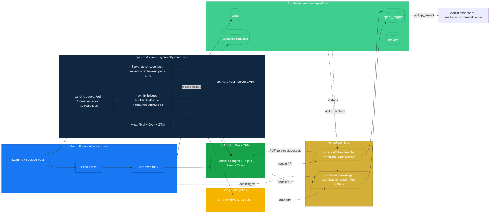
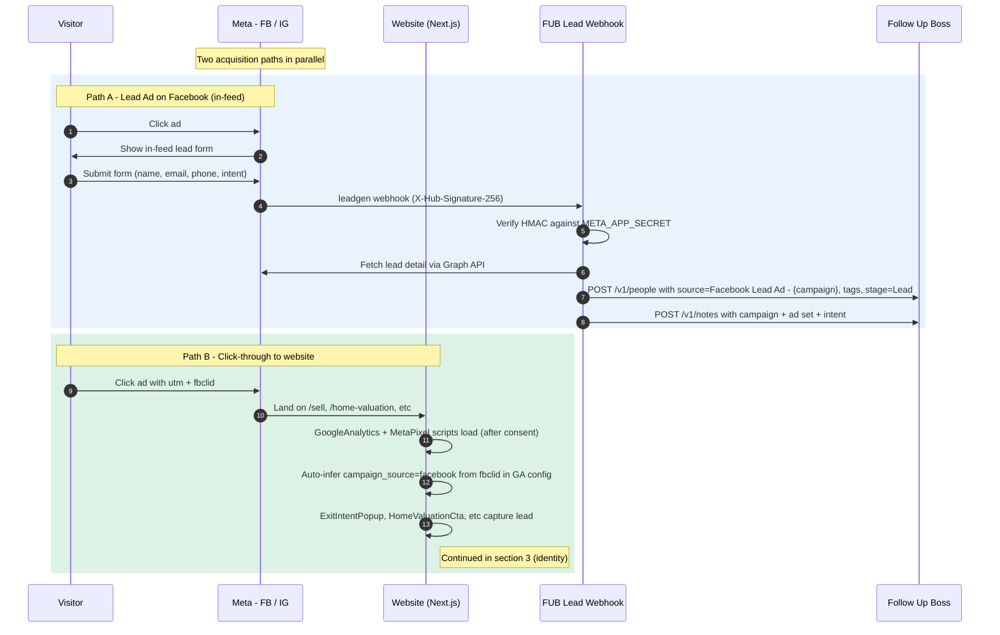
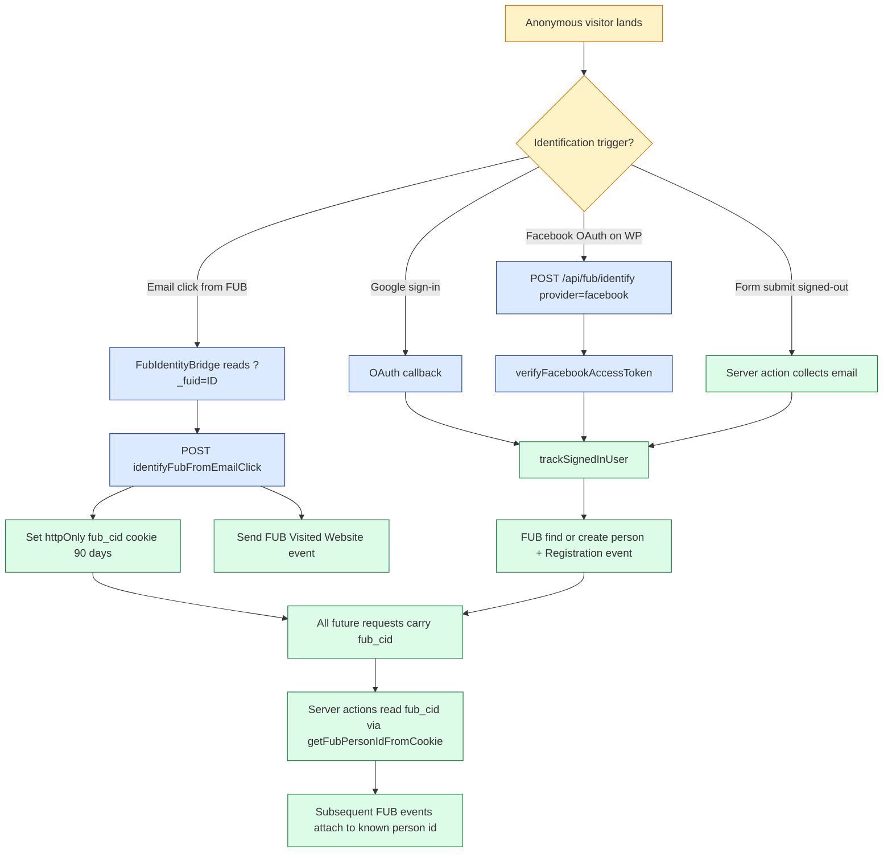
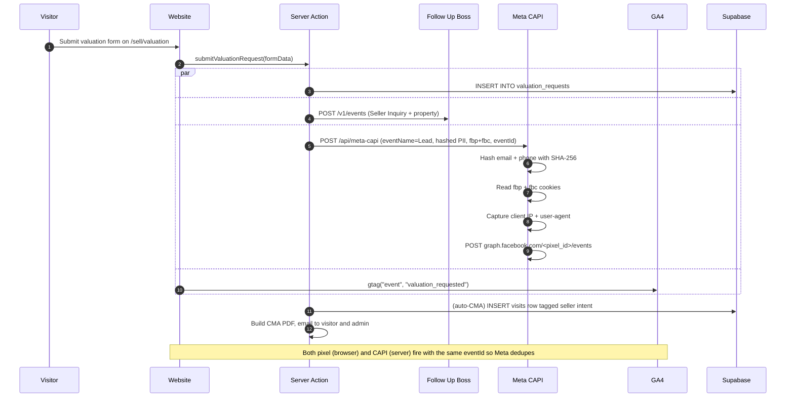
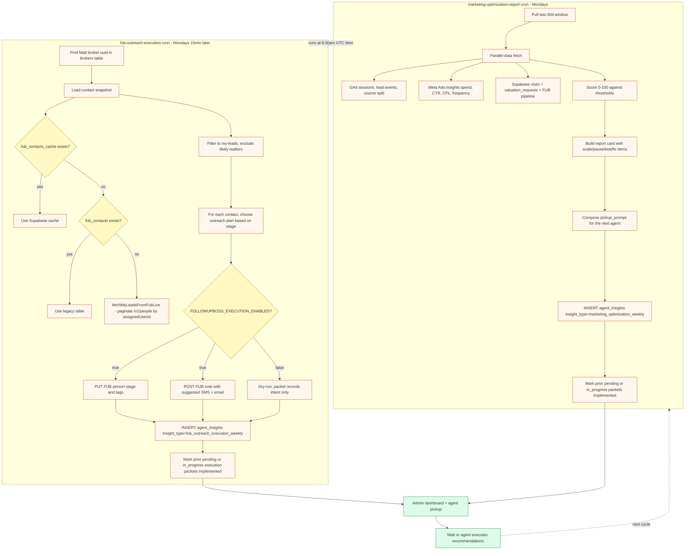
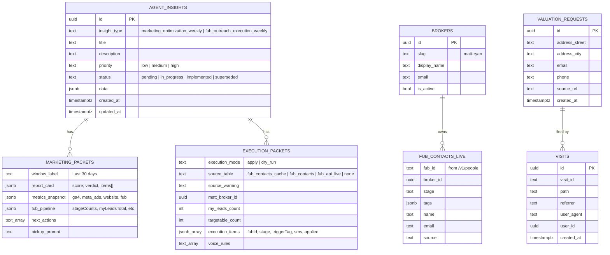

# Facebook Seller Growth Pipeline

**The end-to-end seller-lead system for Ryan Realty.** From a Facebook ad impression all the way to a stage-tagged contact in Follow Up Boss with a weekly optimization packet that any agent can pick up and execute.

This is the canonical reference. If anything in `docs/`, `.claude/skills/`, or any cursor rule conflicts with this file, this file wins for the *flow* (skills still win for editorial / brand voice).

> **Status as of 2026-05-10:** All five layers are live in production at commit `91051eb7`. Latest weekly score: **65/100 (needs_attention)**. GA4 reporting confirmed. FUB outreach: 1500 my-leads, 1433 targetable, 150 outreach packets generated, 55 applied to FUB this cycle.

---

## Table of contents

1. [System map](#1-system-map)
2. [Acquisition layer (Meta → website)](#2-acquisition-layer-meta--website)
3. [Identity stitching (anon → known FUB contact)](#3-identity-stitching-anon--known-fub-contact)
4. [Conversion event fan-out](#4-conversion-event-fan-out)
5. [Weekly automation loops](#5-weekly-automation-loops)
6. [Optimization decision loop](#6-optimization-decision-loop)
7. [Data + storage map](#7-data--storage-map)
8. [Cron schedule](#8-cron-schedule)
9. [Production env vars (live state)](#9-production-env-vars-live-state)
10. [Verification commands](#10-verification-commands)
11. [Files + ownership](#11-files--ownership)
12. [Open follow-ups](#12-open-follow-ups)

---

## 1. System map



The five layers, in order:

1. **Acquisition** — Meta delivers a click or a Lead Ad form fill.
2. **Identity stitching** — anonymous visitor gets bound to a Follow Up Boss person id (via Google sign-in, Facebook OAuth, or the email-click `_fuid` cookie).
3. **Conversion event fan-out** — every meaningful action fires events to FUB (Property Inquiry, Seller Inquiry, Saved Property, etc.), Meta Conversions API (deduped with the browser pixel via `event_id`), GA4 (via gtag), and Supabase (`visits`, `valuation_requests`).
4. **Weekly automation loops** — two Vercel crons run every Monday morning, write structured packets to `agent_insights`, and one of them also writes stage + tag updates back to FUB people.
5. **Optimization decision loop** — packets are scored 0–100 and tagged `strong / needs_attention / at_risk`. Recommendations are typed `scale / pause / test / fix / watch`. Any agent (or Matt) reads the latest packet and executes the next cycle's changes.

---

## 2. Acquisition layer (Meta → website)



**Key files**

| Path | Role |
|---|---|
| `app/api/meta/lead-webhook/route.ts` | Receives FB Lead Ad webhooks, verifies HMAC, fetches lead detail, creates FUB person + note |
| `lib/fub-client.mjs` | `createPerson`, `addNote`, `findPersonByEmail` for direct FUB People API writes |
| `components/MetaPixel.tsx` | Loads `fbevents.js` after marketing consent, fires PageView |
| `components/GoogleAnalytics.tsx` | Loads gtag.js, infers `campaign_source=facebook` from `fbclid` when no UTM is set |
| `components/PageViewTracker.tsx` | Fires GA4 + Meta page_view on every SPA route change after consent |

**Required env vars for this layer** — `META_APP_SECRET`, `META_PAGE_ACCESS_TOKEN` (or `META_PAGE_TOKEN`), `META_AD_ACCOUNT_ID`, `META_APP_ID`, `META_FB_PAGE_ID`, `META_IG_BUSINESS_ACCOUNT_ID`, `NEXT_PUBLIC_META_PIXEL_ID`, `META_CAPI_ACCESS_TOKEN`, `NEXT_PUBLIC_GA4_MEASUREMENT_ID`, `FOLLOWUPBOSS_API_KEY` (also accepted as `FUB_API_KEY`), `FUB_PIPELINE_ID` (optional but recommended).

---

## 3. Identity stitching (anon → known FUB contact)



**Three independent identification doors all converge on the same `fub_cid` cookie + FUB person id.** Once a visitor is identified by any path, every later server action (`trackHomeValuationCta`, `submitContactForm`, `submitValuationRequest`, `submitExitIntentLead`, `submitPageCTA`, `trackListingView`, `trackPageView`, `trackReturnVisit`) attaches its event to that FUB person id automatically.

**Key files**

| Path | Role |
|---|---|
| `app/api/fub/identify/route.ts` | Cross-origin (ryan-realty.com WordPress site) — verifies Google ID token or Facebook access token server-side, never trusts the email from the body |
| `app/api/fub/track-page/route.ts` | Cross-origin page-tracking with intent-tag merging and high-intent task creation |
| `app/actions/fub-identity-bridge.ts` | `identifyFubFromEmailClick` (sets cookie) + `getFubPersonIdFromCookie` |
| `components/FubIdentityBridge.tsx` | Client-side bridge: reads `?_fuid=` from URL, fires identify, removes the param so the URL stays clean |
| `components/AgentAttributionBridge.tsx` | Captures `?agent=` query param into `rr_agent_attribution` cookie for broker attribution |
| `lib/followupboss.ts` | The full FUB API surface: events, tags, notes, tasks, broker attribution, automation state updates |

---

## 4. Conversion event fan-out

When a known visitor (or in some cases an anonymous one) takes a meaningful action, every event fans out to four destinations in parallel: FUB (CRM source of truth), Meta CAPI (server-side conversion API for ad attribution), GA4 (analytics + optimization scoring), and Supabase (analytics warehouse + cron inputs).



**Event taxonomy on the wire**

| User action | FUB event | Meta CAPI eventName | GA4 event |
|---|---|---|---|
| Sign in (Google) | Registration | (no CAPI) | sign_up |
| View listing detail | Viewed Property | ViewContent | view_listing |
| Save listing | Saved Property | Lead | save_listing + generate_lead |
| Click "contact agent" | Property Inquiry | Lead | contact_agent_click |
| Submit valuation form | Seller Inquiry | Lead | valuation_requested |
| Submit contact form | General Inquiry | Lead | generate_lead |
| Exit-intent submit | Registration | (no CAPI) | newsletter_signup |
| Return visit (24h+) | Visited Website (msg=return) | (no CAPI) | return_visit |

**Pixel ↔ CAPI deduplication.** Every `Lead` event sent to Meta CAPI carries an `event_id` generated by `generateEventId()` from `lib/meta-pixel-helpers.ts`. The browser pixel fires the same event with the same id so Meta merges them and counts a single conversion. This is critical for ad attribution — without dedup, conversions are double-counted and CPL math breaks.

---

## 5. Weekly automation loops

Two Vercel crons run every Monday morning (Pacific time, since `vercel.json` schedule strings are UTC and 6:30 / 6:45 UTC ≈ 11:30 / 11:45 PM Sunday Pacific the prior night, but in practice the reporting is for the Monday that follows). They write structured packets to the `agent_insights` table.



**FUB outreach plan selection (by stage)**

| Current FUB stage | Trigger tag | Target stage | Suggested next action |
|---|---|---|---|
| New Lead / Lead / Unstaged | `auto:seller-seq:new` | Attempting Contact | SMS + email with valuation snapshot offer |
| Attempting Contact | `auto:seller-seq:attempt` | Attempting Contact | Calm follow-up, no pressure |
| Connected / Seller Nurture | `auto:seller-seq:nurture` | Seller Nurture | Updated Bend snapshot value drop |
| Anything else | `auto:seller-seq:watch` | (no change) | "Here when you need a clear plan" |
| Listing Signed / Closed / Disqualified / Do Not Contact / Archive | (skipped) | (no change) | No automation fires |

Outreach is rate-capped at 150 contacts per cron run (`targetable.slice(0, 150)`).

---

## 6. Optimization decision loop

Every weekly packet ships a 0–100 score, a verdict, and 0–N typed recommendations. The agent (Matt or any AI agent reading the packet) decides what to ship next.

```mermaid
flowchart LR
    PACKET[agent_insights packet] --> SCORE{score?}
    SCORE -->|>= 75| STRONG[strong - scale]
    SCORE -->|50-74| NEED[needs_attention - test + fix]
    SCORE -->|< 50| RISK[at_risk - fix critical first]

    STRONG --> ACT[Read recommendations]
    NEED --> ACT
    RISK --> ACT

    ACT --> FIX[fix - data plumbing missing]
    ACT --> SCALE[scale - more budget on winner]
    ACT --> PAUSE[pause - kill underperformer]
    ACT --> TEST[test - one creative + one audience hypothesis]
    ACT --> WATCH[watch - no action this cycle]

    FIX --> CYCLE[Wait for next Monday cron + re-score]
    SCALE --> CYCLE
    PAUSE --> CYCLE
    TEST --> CYCLE
    WATCH --> CYCLE

    CYCLE -. update LEARNINGS.md .-> SKILL[.claude/skills/facebook-seller-growth/LEARNINGS.md]

    classDef strong fill:#bbf7d0,stroke:#15803d
    classDef warn fill:#fef08a,stroke:#a16207
    classDef risk fill:#fecaca,stroke:#b91c1c
    classDef action fill:#e0e7ff,stroke:#3730a3

    class STRONG strong
    class NEED warn
    class RISK risk
    class FIX,SCALE,PAUSE,TEST,WATCH,ACT,CYCLE,SKILL action
```

**Score components (`app/actions/dashboard.ts`)**

| Signal | Points | Threshold |
|---|---|---|
| Meta Ads API configured + summary returned | +20 | configured + summary present |
| GA4 service account configured + responding | +20 | `ga.ok === true` |
| FUB API key configured | +15 | `FOLLOWUPBOSS_API_KEY` set |
| Meta frequency healthy | +10 / +5 / 0 | ≤2.8 / ≤3.5 / >3.5 |
| Meta CTR healthy | +10 / +5 / 0 | ≥1.2% / ≥0.8% / <0.8% |
| Meta CPL healthy | +10 / +5 / 0 | ≤$25 / ≤$40 / >$40 |
| Facebook seller-visit → valuation rate | +10 / +5 / 0 | ≥3% / ≥2% / <2% |
| FUB Facebook capture rate | +5 / 0 | ≥80% / <80% |

**Verdict thresholds:** `>=75 strong`, `50–74 needs_attention`, `<50 at_risk`.

Every recommendation carries an `action` (`scale / pause / test / fix / watch`) and a `priority` (`high / medium / low`). The pickup prompt lays them out in order so an agent can execute top-down.

---

## 7. Data + storage map



**Notable:** `fub_contacts_cache` and `fub_contacts` were dropped in migration `20260330100006_drop_unused_tables.sql`. Both the dashboard pipeline snapshot and the outreach execution cron now fall through to the live FUB People API when those tables are absent (added in commit `2762ec96`, see `lib/followupboss.ts` `fetchMyLeadsFromFubLive`).

---

## 8. Cron schedule

All schedules are UTC (Vercel cron convention). Pacific time conversions are approximate.

```mermaid
gantt
    title Weekly cron schedule (UTC)
    dateFormat HH:mm
    axisFormat %H:%M

    section Sync + caches
    sync-delta - every 10min : 00:00, 24h
    sync-history-terminal - every 5min : 00:00, 24h

    section Reporting
    refresh-market-stats - every 6h : 00:00, 24h
    refresh-reporting-cache - daily 03:15 : 03:15, 1m

    section Marketing optimization Mon
    optimization-loop - 06:00 Mon : 06:00, 1m
    marketing-optimization-report - 06:30 Mon : 06:30, 1m
    fub-outreach-execution - 06:45 Mon : 06:45, 1m

    section Comms
    saved-search-alerts - daily 14:00 : 14:00, 1m
    market-report - Sat 14:00 : 14:00, 1m
```

**The Marketing Mon block is the seller growth loop.** It runs serially: optimization-loop first (broader system review), then marketing-optimization-report (writes the marketing packet), then fub-outreach-execution (writes the execution packet and applies to FUB).

---

## 9. Production env vars (live state)

Verified in Vercel production on 2026-05-10.

| Var | Status | Purpose |
|---|---|---|
| `FOLLOWUPBOSS_API_KEY` | ✅ | FUB People + Events + Notes + Tasks |
| `FOLLOWUPBOSS_EXECUTION_ENABLED` | ✅ true | Toggles apply vs dry-run for outreach cron |
| `META_AD_ACCOUNT_ID` | ✅ | Pull Meta Ads insights (spend, CTR, CPL) |
| `META_PAGE_ACCESS_TOKEN` | ✅ | Lead Ads webhook + Ads insights |
| `META_APP_ID` + `META_APP_SECRET` | ✅ | Webhook HMAC verify + FB OAuth |
| `META_CAPI_ACCESS_TOKEN` | ✅ | Server-side Conversions API |
| `NEXT_PUBLIC_META_PIXEL_ID` | ✅ | Browser pixel |
| `META_FB_PAGE_ID` + `META_IG_BUSINESS_ACCOUNT_ID` | ✅ | Page + IG identity |
| `NEXT_PUBLIC_GA4_MEASUREMENT_ID` | ✅ G-ST40W4WM6T | gtag config |
| `GOOGLE_GA4_PROPERTY_ID` | ✅ 527333348 | GA4 Data API target |
| `GOOGLE_SERVICE_ACCOUNT_CLIENT_EMAIL` | ✅ viewer@ryanrealty.iam.gserviceaccount.com | GA4 Data API auth |
| `GOOGLE_SERVICE_ACCOUNT_PRIVATE_KEY` | ✅ | GA4 Data API auth |
| `GOOGLE_SERVICE_ACCOUNT_SUBJECT` | ✅ matt@ryan-realty.com | DWD impersonation subject |
| `CRON_SECRET` | ✅ | Bearer auth for cron endpoints |
| `NEXT_PUBLIC_SUPABASE_URL` + `SUPABASE_SERVICE_ROLE_KEY` | ✅ | Supabase service-role writes |
| `FUB_PIPELINE_ID` | ⚠️ optional | Routes new FB Lead Ad people into specific pipeline |
| `FOLLOWUPBOSS_BROKER_USER_MAP` | ⚠️ optional | Slug → FUB userId map for `fetchMyLeadsFromFubLive` |
| `FOLLOWUPBOSS_REQUIRE_BROKER_ASSIGNMENT` | ⚠️ optional | Hard-fail events when broker assignment can't resolve |

**Preview + development environments** are missing the GA4 service account vars (Vercel CLI bug demanding a git branch arg even with `--yes --value --force --sensitive`). Production is sufficient for the cron loop. Add via the Vercel dashboard env UI when preview parity is needed.

---

## 10. Verification commands

**Live cron health (one-shot, requires `CRON_SECRET`):**

```bash
vercel env pull ".env.vercel.production.tmp" --environment=production --yes
CRON_SECRET_VALUE=$(grep '^CRON_SECRET=' .env.vercel.production.tmp | sed -E 's/^CRON_SECRET="?([^"]*)"?$/\1/')

# Marketing optimization report
curl -sS -H "Authorization: Bearer ${CRON_SECRET_VALUE}" \
  "https://ryanrealty.vercel.app/api/cron/marketing-optimization-report"

# FUB outreach execution
curl -sS -H "Authorization: Bearer ${CRON_SECRET_VALUE}" \
  "https://ryanrealty.vercel.app/api/cron/fub-outreach-execution"

rm -f .env.vercel.production.tmp
```

**Latest packet inspection (Supabase):**

```sql
select id, insight_type, status, data->'report_card'->'score' as score,
       data->'report_card'->'verdict' as verdict, created_at
from public.agent_insights
where insight_type in ('marketing_optimization_weekly', 'fub_outreach_execution_weekly')
order by created_at desc
limit 5;
```

**Pickup prompt (latest marketing packet) — paste into any agent:**

```sql
select data->>'pickup_prompt' as prompt
from public.agent_insights
where insight_type = 'marketing_optimization_weekly'
order by created_at desc
limit 1;
```

**Grant a new service account viewer access on the GA4 property:**

```bash
node scripts/grant-ga4-viewer-access.mjs
# or with a different SA:
node scripts/grant-ga4-viewer-access.mjs --service-account other@project.iam.gserviceaccount.com
```

---

## 11. Files + ownership

```mermaid
flowchart LR
    subgraph SHARED[Shared infra]
        FUB_LIB[lib/followupboss.ts]
        FUB_CLI[lib/fub-client.mjs]
        MCAPI[lib/meta-capi.ts]
        TRACK[lib/tracking.ts]
    end

    subgraph ACQ[Acquisition + identity]
        IDR[app/api/fub/identify/route.ts]
        TPR[app/api/fub/track-page/route.ts]
        IDB[app/actions/fub-identity-bridge.ts]
        FUBC[components/FubIdentityBridge.tsx]
        ATTC[components/AgentAttributionBridge.tsx]
    end

    subgraph FORMS[Conversion server actions]
        CONT[app/contact/actions.ts]
        VAL[app/home-valuation/actions.ts]
        LEAD[app/actions/lead-capture.ts]
        MCR[app/api/meta-capi/route.ts]
        LWH[app/api/meta/lead-webhook/route.ts]
    end

    subgraph CRON[Weekly automation]
        MOR[app/api/cron/marketing-optimization-report/route.ts]
        FOE[app/api/cron/fub-outreach-execution/route.ts]
        DASH[app/actions/dashboard.ts]
        GA[app/actions/ga4-report.ts]
    end

    subgraph UI[Admin command center]
        ADM[app/admin/(protected)/page.tsx]
        PNL[components/admin/DashboardMarketingCommandCenterPanel.tsx]
    end

    subgraph SKILLS[Skill + ops]
        SK[.claude/skills/facebook-seller-growth/SKILL.md]
        LRN[.claude/skills/facebook-seller-growth/LEARNINGS.md]
        CLR[CLOUD_ROUTINE_PROMPT.md]
        GRANT[scripts/grant-ga4-viewer-access.mjs]
        DOC[docs/FACEBOOK_SELLER_GROWTH_PIPELINE.md]
    end

    ACQ --> SHARED
    FORMS --> SHARED
    CRON --> SHARED
    DASH --> GA
    DASH --> SHARED
    UI --> DASH
    UI --> CRON
    SKILLS -. references .-> CRON
    SKILLS -. references .-> SHARED
    SKILLS -. references .-> UI

    classDef shared fill:#fef3c7,stroke:#a16207
    classDef acq fill:#dbeafe,stroke:#1e40af
    classDef forms fill:#dcfce7,stroke:#15803d
    classDef cron fill:#fed7aa,stroke:#c2410c
    classDef ui fill:#e9d5ff,stroke:#7e22ce
    classDef skill fill:#fce7f3,stroke:#be185d

    class FUB_LIB,FUB_CLI,MCAPI,TRACK shared
    class IDR,TPR,IDB,FUBC,ATTC acq
    class CONT,VAL,LEAD,MCR,LWH forms
    class MOR,FOE,DASH,GA cron
    class ADM,PNL ui
    class SK,LRN,CLR,GRANT,DOC skill
```

---

## 12. Open follow-ups

Sorted by ROI, highest-impact first.

1. **Improve `applied_count` in FUB outreach (current: 55 of 150).** `updatePersonAutomationState` returns `false` when the contact already has the target stage and merged tags, so `applied = stateApplied || noteApplied` stays false on contacts that only need a note. Fix: always attempt `addPersonNote` so each generated outreach record has at least the note artifact in FUB. File: `app/api/cron/fub-outreach-execution/route.ts`.
2. **Push GA4 service account creds to Vercel preview + development.** Production is wired but preview/dev still return `GA4_NOT_CONFIGURED`. Vercel CLI bug demands a git branch arg — easiest path is the Vercel dashboard env UI.
3. **Restore `fub_contacts_cache` mirror table.** The dashboard pipeline snapshot pays a FUB API cost on every render right now; only the weekly cron should pay that. Spec a small sync (FUB people → Supabase) on a 30-min cron.
4. **Lift Meta Ads CTR.** Latest packet recommends `[TEST][MEDIUM] Low click-through rate — CTR is 0.00%. Test stronger hooks, seller pain-point headlines, and first-frame visuals.` Action lives in Meta Ads Manager, not the codebase.
5. **Resolve the Bend Policy Pulse 3-part series state mismatch.** Files `bend_policy_pulse_part{1,2,3}.mp4` are in `public/v5_library/` but the scorecard says they're drafts awaiting review. Either approve them and update the scorecard or pull the MP4s back out. Tracked separately from this pipeline but called out here for handoff completeness.
6. **Decide on a strict broker user map.** Setting `FOLLOWUPBOSS_BROKER_USER_MAP=matt-ryan:<userId>` would let `fetchMyLeadsFromFubLive` skip the email lookup and shave a network call per cron.

---

**Where to learn more:**

- Skill — `.claude/skills/facebook-seller-growth/SKILL.md` (canonical routine for cloud + local Claude runs)
- Learnings — `.claude/skills/facebook-seller-growth/LEARNINGS.md` (one entry per cycle)
- FUB integration — `docs/FOLLOWUPBOSS-SETUP.md`
- Admin dashboard — `docs/ADMIN_DASHBOARD.md`
- Cross-agent handoff — `docs/plans/CROSS_AGENT_HANDOFF.md`
