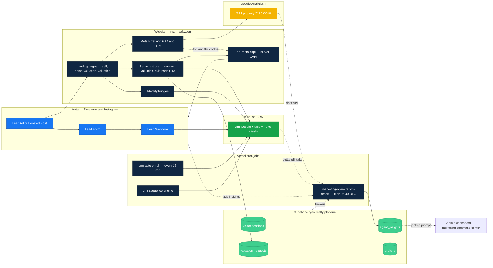
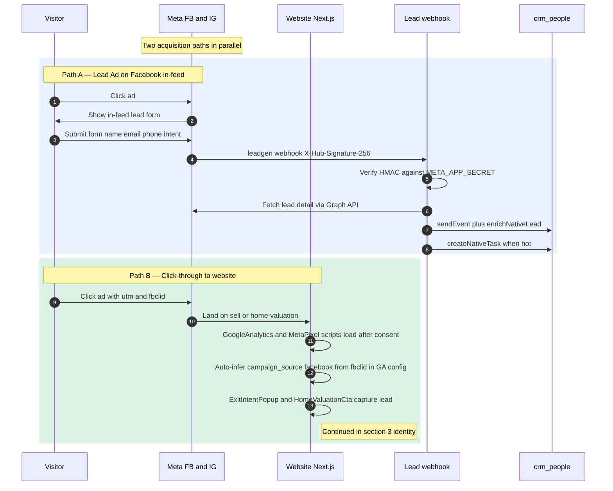
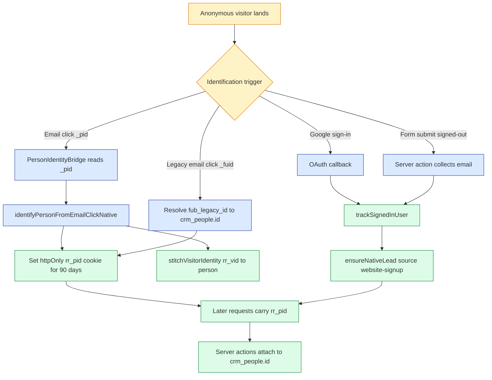
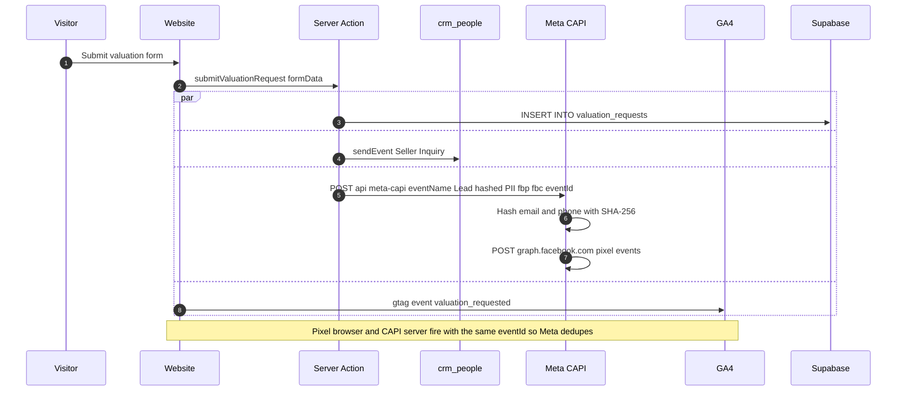
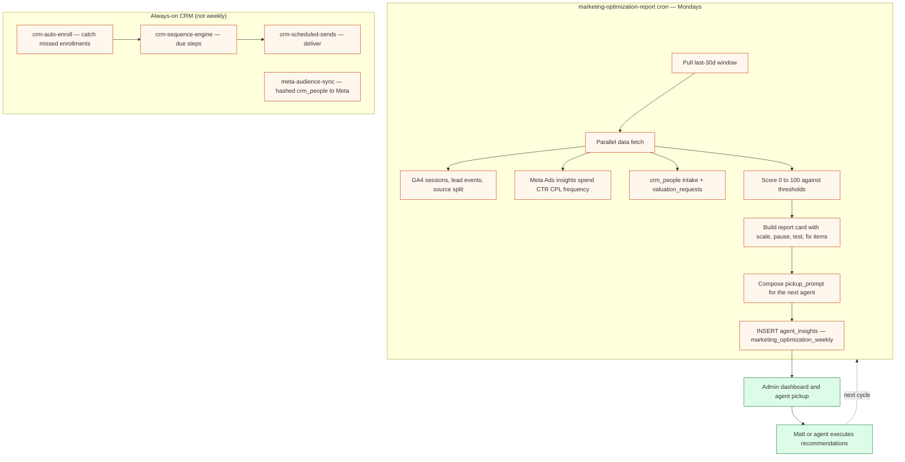
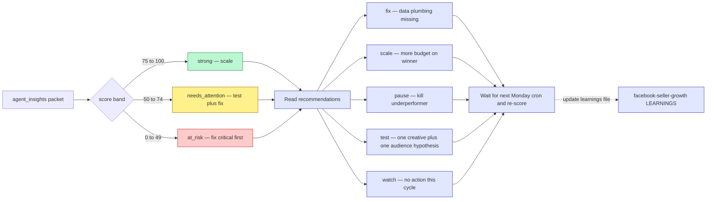
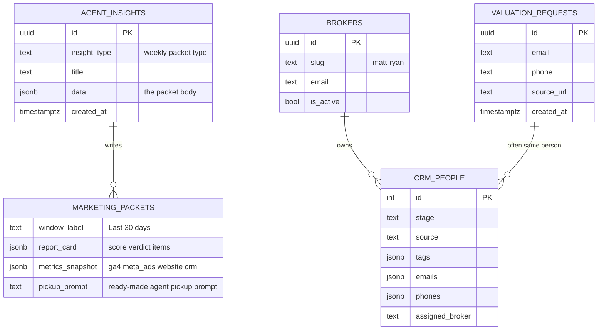
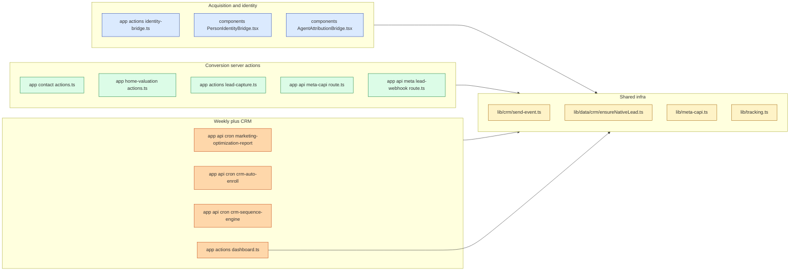

# Facebook Seller Growth Pipeline

**The end-to-end seller-lead system for Ryan Realty.** From a Facebook ad impression to a tagged row in **`crm_people`**, with a weekly optimization packet any agent can pick up and execute.

**For AI agents:** Treat this file as the **single front door** for marketing and advertising work in this repo. It is linked from **`AGENTS.md`**, **`CLAUDE.md`** (Skill Routing), **`.cursor/rules/marketing-advertising-workflow.mdc`**, and **`.cursor/skills/facebook-seller-growth/SKILL.md`**. Load it before editing cron routes, dashboard marketing actions, CAPI, or advising on Meta campaigns.

**Path-by-path lead creation** (webhooks, forms, pixel plus CAPI dedup, where rows land, troubleshooting): **`docs/MARKETING_LEAD_FLOW.md`**.

This is the canonical reference. If anything in `docs/`, `.claude/skills/`, or any cursor rule conflicts with this file, this file wins for the *flow* (skills still win for editorial / brand voice).

> **Status as of 2026-08-18:** Capture is native. **`sendEvent()`** in **`lib/crm/send-event.ts`** writes **`crm_people`**. the in-house CRM is decommissioned (2026-06-24). Do not POST to a vendor People/Events API. Do not list `retired vendor-CRM env names` as required. CAPI Lead events still carry $value for Meta bid optimization. Weekly digest email lands in `MARKETING_DIGEST_EMAIL` after the marketing cron.

---

## Table of contents

1. [System map](#1-system-map)
2. [Acquisition layer (Meta → website)](#2-acquisition-layer-meta--website)
3. [Identity stitching (anon → known CRM person)](#3-identity-stitching-anon--known-crm-person)
4. [Conversion event fan-out](#4-conversion-event-fan-out)
5. [Weekly automation loops](#5-weekly-automation-loops)
6. [Optimization decision loop](#6-optimization-decision-loop)
7. [Data + storage map](#7-data--storage-map)
8. [Cron schedule](#8-cron-schedule)
9. [Production env vars (live state)](#9-production-env-vars-live-state)
10. [Verification commands](#10-verification-commands)
11. [Files + ownership](#11-files--ownership)
12. [Open follow-ups](#12-open-follow-ups)

---

## 1. System map


```mermaid
flowchart LR
    subgraph META["Meta — Facebook and Instagram"]
        FBAD["Lead Ad or Boosted Post"]
        FBLEAD["Lead Form"]
        FBLW["Lead Webhook"]
    end

    subgraph SITE["Website — ryan-realty.com"]
        LP["Landing pages — sell, home-valuation, valuation"]
        PIXEL["Meta Pixel and GA4 and GTM"]
        CAPI["api meta-capi — server CAPI"]
        IDBR["Identity bridges"]
        FORMS["Server actions — contact, valuation, exit, page CTA"]
    end

    subgraph CRM["In-house CRM"]
        PEOPLE["crm_people + tags + notes + tasks"]
    end

    subgraph SUPA["Supabase ryan-realty-platform"]
        VIS[(visitor sessions)]
        VAL[(valuation_requests)]
        AI[(agent_insights)]
        BRK[(brokers)]
    end

    subgraph CRON["Vercel cron jobs"]
        MOR["marketing-optimization-report — Mon 06:30 UTC"]
        ENR["crm-auto-enroll — every 15 min"]
        SEQ["crm-sequence-engine"]
    end

    subgraph GA["Google Analytics 4"]
        GA4["GA4 property 527333348"]
    end

    FBAD --> FBLEAD
    FBLEAD --> FBLW
    FBLW --> PEOPLE
    FBAD --> LP
    LP --> PIXEL
    LP --> IDBR
    LP --> FORMS
    PIXEL --> GA4
    PIXEL -. fbp and fbc cookie .-> CAPI
    FORMS --> PEOPLE
    FORMS --> CAPI
    FORMS --> VAL
    CAPI --> META
    IDBR --> PEOPLE
    GA4 -. data API .-> MOR
    META -. ads insights .-> MOR
    PEOPLE -. getLeadIntake .-> MOR
    SUPA -. brokers .-> MOR
    ENR --> PEOPLE
    SEQ --> PEOPLE
    MOR --> AI
    AI -. pickup prompt .-> ADMIN["Admin dashboard — marketing command center"]

    classDef meta fill:#1877F2,stroke:#0a4cb3,color:#fff
    classDef site fill:#102742,stroke:#0a1c30,color:#fff
    classDef crm fill:#16a34a,stroke:#15803d,color:#fff
    classDef supa fill:#3ECF8E,stroke:#249b6a,color:#fff
    classDef cron fill:#102742,stroke:#0a1c30,color:#fff
    classDef ga fill:#F4B400,stroke:#b58300,color:#fff

    class FBAD,FBLEAD,FBLW meta
    class LP,PIXEL,CAPI,IDBR,FORMS site
    class PEOPLE crm
    class VIS,VAL,AI,BRK supa
    class MOR,ENR,SEQ cron
    class GA4 ga
```

The five layers, in order:

1. **Acquisition** — Meta delivers a click or a Lead Ad form fill.
2. **Identity stitching** — anonymous visitor binds to a **`crm_people.id`** (Google sign-in, form submit, or email-click `?_pid=` / legacy `?_fuid=`).
3. **Conversion event fan-out** — every meaningful action fires **`sendEvent`** (Seller Inquiry, General Inquiry, …), Meta Conversions API (deduped with the browser pixel via `event_id`), GA4 (via gtag), and extra Supabase rows where needed (`valuation_requests`, `processed_meta_leads`).
4. **Weekly automation loops** — Monday **`marketing-optimization-report`** writes a scored packet to `agent_insights`. Day-to-day nurture is **`crm-auto-enroll`** + **`crm-sequence-engine`**, not a vendor outreach cron.
5. **Optimization decision loop** — packets are scored 0–100 and tagged `strong / needs_attention / at_risk`. Recommendations are typed `scale / pause / test / fix / watch`.

---

## 2. Acquisition layer (Meta → website)


```mermaid
sequenceDiagram
    autonumber
    participant U as Visitor
    participant M as Meta FB and IG
    participant W as Website Next.js
    participant WH as Lead webhook
    participant CRM as crm_people

    Note over M: Two acquisition paths in parallel

    rect rgb(232,243,253)
        Note over U,M: Path A — Lead Ad on Facebook in-feed
        U->>M: Click ad
        M->>U: Show in-feed lead form
        U->>M: Submit form name email phone intent
        M->>WH: leadgen webhook X-Hub-Signature-256
        WH->>WH: Verify HMAC against META_APP_SECRET
        WH->>M: Fetch lead detail via Graph API
        WH->>CRM: sendEvent plus enrichNativeLead
        WH->>CRM: createNativeTask when hot
    end

    rect rgb(220,242,228)
        Note over U,W: Path B — Click-through to website
        U->>M: Click ad with utm and fbclid
        M->>W: Land on sell or home-valuation
        W->>W: GoogleAnalytics and MetaPixel scripts load after consent
        W->>W: Auto-infer campaign_source facebook from fbclid in GA config
        W->>W: ExitIntentPopup and HomeValuationCta capture lead
        Note right of W: Continued in section 3 identity
    end
```

**Key files**

| Path | Role |
|---|---|
| `app/api/meta/lead-webhook/route.ts` | Receives FB Lead Ad webhooks, verifies HMAC, fetches lead detail, writes `crm_people` + note + task |
| `lib/crm/send-event.ts` | `sendEvent` → `ensureNativeLead` (the one public write entry) |
| `components/MetaPixel.tsx` | Loads `fbevents.js` after marketing consent, fires PageView |
| `components/GoogleAnalytics.tsx` | Loads gtag.js, infers `campaign_source=facebook` from `fbclid` when no UTM is set |
| `components/PageViewTracker.tsx` | Fires GA4 + Meta page_view on every SPA route change after consent |

**Required env vars for this layer** — `META_APP_SECRET`, `META_PAGE_ACCESS_TOKEN` (or `META_PAGE_TOKEN`), `META_AD_ACCOUNT_ID`, `META_APP_ID`, `META_CAPI_ACCESS_TOKEN`, `NEXT_PUBLIC_META_PIXEL_ID`, `NEXT_PUBLIC_GA4_MEASUREMENT_ID`. No vendor CRM API key.

---

## 3. Identity stitching (anon → known CRM person)


```mermaid
flowchart TD
    A["Anonymous visitor lands"] --> B{"Identification trigger"}

    B -->|Email click _pid| C["PersonIdentityBridge reads _pid"]
    C --> D["identifyPersonFromEmailClickNative"]
    D --> E["Set httpOnly rr_pid cookie for 90 days"]
    D --> F["stitchVisitorIdentity rr_vid to person"]

    B -->|Legacy email click _fuid| C2["Resolve fub_legacy_id to crm_people.id"]
    C2 --> E

    B -->|Google sign-in| G["OAuth callback"]
    G --> H["trackSignedInUser"]
    H --> I["ensureNativeLead source website-signup"]

    B -->|Form submit signed-out| L["Server action collects email"]
    L --> H

    E --> M["Later requests carry rr_pid"]
    I --> M
    M --> N["Server actions attach to crm_people.id"]

    classDef trigger fill:#fef3c7,stroke:#d97706
    classDef bridge fill:#dbeafe,stroke:#1e40af
    classDef crm fill:#dcfce7,stroke:#15803d

    class A,B trigger
    class C,C2,D,G,L bridge
    class E,F,H,I,M,N crm
```

**Doors converge on `rr_pid` + `crm_people.id`.** `rr_vid` is the durable anonymous cookie (middleware). Once identified, later actions (`trackHomeValuationCta`, `submitContactForm`, `submitValuationRequest`, `submitExitIntentLead`, `submitPageCTA`, listing views) attach to that person.

**Key files**

| Path | Role |
|---|---|
| `app/actions/identity-bridge.ts` | `identifyPersonFromEmailClick` / `identifyPersonFromEmailClickNative` |
| `components/PersonIdentityBridge.tsx` | Client: reads `?_pid=` / `?_fuid=`, sets cookie, strips the param |
| `components/AgentAttributionBridge.tsx` | Captures `?agent=` into `rr_agent_attribution` |
| `lib/visitor-backfill.ts` | `stitchVisitorIdentity` — `rr_vid` → person / email / auth user |
| `lib/crm/send-event.ts` | Native capture + `trackSignedInUser` |

There is no `/api/fub/*` surface. Do not add one.

---

## 4. Conversion event fan-out

When a known visitor (or in some cases an anonymous one) takes a meaningful action, the event fans out: CRM (`sendEvent`), Meta CAPI, GA4, and extra Supabase rows.


```mermaid
sequenceDiagram
    autonumber
    participant U as Visitor
    participant W as Website
    participant SA as Server Action
    participant CRM as crm_people
    participant MC as Meta CAPI
    participant GA as GA4
    participant DB as Supabase

    U->>W: Submit valuation form
    W->>SA: submitValuationRequest formData
    par
        SA->>DB: INSERT INTO valuation_requests
    and
        SA->>CRM: sendEvent Seller Inquiry
    and
        SA->>MC: POST api meta-capi eventName Lead hashed PII fbp fbc eventId
        MC->>MC: Hash email and phone with SHA-256
        MC->>MC: POST graph.facebook.com pixel events
    and
        W->>GA: gtag event valuation_requested
    end

    Note over W,GA: Pixel browser and CAPI server fire with the same eventId so Meta dedupes
```

**Event taxonomy on the wire**

| User action | CRM event type (`sendEvent`) | Meta CAPI eventName | GA4 event |
|---|---|---|---|
| Sign in (Google) | Registration (`trackSignedInUser`) | (no CAPI) | sign_up |
| View listing detail | Viewed Property | ViewContent | view_listing |
| Save listing | Saved Property | Lead | save_listing + generate_lead |
| Click "contact agent" | Property Inquiry | Lead | contact_agent_click |
| Submit valuation form | Seller Inquiry | Lead | valuation_requested |
| Submit contact form | General Inquiry | Lead | generate_lead |
| Exit-intent submit | Registration | (no CAPI) | newsletter_signup |
| Return visit (24h+) | Visited Website | (no CAPI) | return_visit |

**Pixel ↔ CAPI deduplication.** Every `Lead` event sent to Meta CAPI carries an `event_id` generated by `generateEventId()` from `lib/meta-pixel-helpers.ts`. The browser pixel fires the same event with the same id so Meta merges them and counts a single conversion.

---

## 5. Weekly automation loops

Monday morning UTC, **`marketing-optimization-report`** writes a structured packet to `agent_insights`. Nurture is continuous, not a weekly vendor apply-job.


```mermaid
flowchart TB
    subgraph MOR["marketing-optimization-report cron — Mondays"]
        MOR1["Pull last-30d window"]
        MOR2["Parallel data fetch"]
        MOR2 --> MOR2a["GA4 sessions, lead events, source split"]
        MOR2 --> MOR2b["Meta Ads insights spend CTR CPL frequency"]
        MOR2 --> MOR2c["crm_people intake + valuation_requests"]
        MOR3["Score 0 to 100 against thresholds"]
        MOR4["Build report card with scale, pause, test, fix items"]
        MOR5["Compose pickup_prompt for the next agent"]
        MOR6["INSERT agent_insights — marketing_optimization_weekly"]
        MOR1 --> MOR2 --> MOR3 --> MOR4 --> MOR5 --> MOR6
    end

    subgraph NURTURE["Always-on CRM (not weekly)"]
        ENR["crm-auto-enroll — catch missed enrollments"]
        SEQ["crm-sequence-engine — due steps"]
        SND["crm-scheduled-sends — deliver"]
        AUD["meta-audience-sync — hashed crm_people to Meta"]
    end

    MOR6 --> AGENT["Admin dashboard and agent pickup"]
    ENR --> SEQ --> SND
    AGENT --> ACTION["Matt or agent executes recommendations"]
    ACTION -. next cycle .-> MOR

    classDef step fill:#fff7ed,stroke:#c2410c
    classDef action fill:#dcfce7,stroke:#15803d

    class MOR1,MOR2,MOR2a,MOR2b,MOR2c,MOR3,MOR4,MOR5,MOR6,ENR,SEQ,SND,AUD step
    class AGENT,ACTION action
```

**Sequence selection (by tag)** — see `lib/crm/enroll.ts`. First matching rule wins; UI rules in `crm_automation_rules` override the fallback map.

| Tag | Sequence role |
|---|---|
| `intent:expired-listing` | Expired-listing drip |
| `intent:fsbo` | FSBO drip |
| `audience:seller` | Seller nurture |
| `audience:buyer` | Buyer nurture (email-first until SMS consent) |

Outreach lists (skip-traced farms) never auto-enroll. Pre-2026-06-10 historical book never mass-enrolls.

---

## 6. Optimization decision loop

Every weekly packet ships a 0–100 score, a verdict, and 0–N typed recommendations.


```mermaid
flowchart LR
    PACKET["agent_insights packet"] --> SCORE{"score band"}
    SCORE -->|"75 to 100"| STRONG["strong — scale"]
    SCORE -->|"50 to 74"| NEED["needs_attention — test plus fix"]
    SCORE -->|"0 to 49"| RISK["at_risk — fix critical first"]

    STRONG --> ACT["Read recommendations"]
    NEED --> ACT
    RISK --> ACT

    ACT --> FIX["fix — data plumbing missing"]
    ACT --> SCALE["scale — more budget on winner"]
    ACT --> PAUSE["pause — kill underperformer"]
    ACT --> TEST["test — one creative plus one audience hypothesis"]
    ACT --> WATCH["watch — no action this cycle"]

    FIX --> CYCLE["Wait for next Monday cron and re-score"]
    SCALE --> CYCLE
    PAUSE --> CYCLE
    TEST --> CYCLE
    WATCH --> CYCLE

    CYCLE -. "update learnings file" .-> SKILL["facebook-seller-growth LEARNINGS"]

    classDef strong fill:#bbf7d0,stroke:#15803d
    classDef warn fill:#fef08a,stroke:#a16207
    classDef risk fill:#fecaca,stroke:#b91c1c
    classDef action fill:#e0e7ff,stroke:#3730a3

    class STRONG strong
    class NEED warn
    class RISK risk
    class FIX,SCALE,PAUSE,TEST,WATCH,ACT,CYCLE,SKILL action
```

**Score components (`app/actions/dashboard.ts`)**

| Signal | Points | Threshold |
|---|---|---|
| Meta Ads API configured + summary returned | +20 | configured + summary present |
| GA4 service account configured + responding | +20 | `ga.ok === true` |
| CRM pipeline has recent Matt-assigned people | +15 | `myLeadsTotal > 0` on `crm_people` |
| Meta frequency healthy | +10 / +5 / 0 | ≤2.8 / ≤3.5 / >3.5 |
| Meta CTR healthy | +10 / +5 / 0 | ≥1.2% / ≥0.8% / <0.8% |
| Meta CPL healthy | +10 / +5 / 0 | ≤$25 / ≤$40 / >$40 |
| Facebook seller-visit → valuation rate | +10 / +5 / 0 | ≥3% / ≥2% / <2% |
| Facebook → CRM capture rate | +5 / 0 | ≥80% / <80% (`getLeadIntake` social channel) |
| Meta campaign actively running | +5 / 0 | spend > 0 AND impressions > 0 |
| GA4 traffic above noise floor | +5 / 0 | sessions ≥ 100 in 30d |

**Verdict thresholds:** `>=75 strong`, `50–74 needs_attention`, `<50 at_risk`.

**Bend market context:** when `bendMarketContext.monthsOfSupply ≤ 4.0` (seller's market), the report card appends a `[SCALE][MEDIUM]` recommendation.

Every recommendation carries an `action` (`scale / pause / test / fix / watch`) and a `priority` (`high / medium / low`).

---

## 7. Data + storage map


```mermaid
erDiagram
    AGENT_INSIGHTS ||--o{ MARKETING_PACKETS : "writes"
    BROKERS ||--o{ CRM_PEOPLE : "owns"
    VALUATION_REQUESTS ||--o{ CRM_PEOPLE : "often same person"

    AGENT_INSIGHTS {
        uuid id PK
        text insight_type "weekly packet type"
        text title
        jsonb data "the packet body"
        timestamptz created_at
    }

    MARKETING_PACKETS {
        text window_label "Last 30 days"
        jsonb report_card "score verdict items"
        jsonb metrics_snapshot "ga4 meta_ads website crm"
        text pickup_prompt "ready-made agent pickup prompt"
    }

    CRM_PEOPLE {
        int id PK
        text stage
        text source
        jsonb tags
        jsonb emails
        jsonb phones
        text assigned_broker
    }

    BROKERS {
        uuid id PK
        text slug "matt-ryan"
        text email
        bool is_active
    }

    VALUATION_REQUESTS {
        uuid id PK
        text email
        text phone
        text source_url
        timestamptz created_at
    }
```

**Notable:** There is no live vendor contacts cache. Dashboard pipeline + Facebook capture counts read **`crm_people`** (`getFubPipelineSnapshot` is a leftover function name; the query is native). Meta Custom Audience sync is **`syncCrmAudience()`** — hashed, suppression-gated, dry-run unless `META_AUDIENCE_PUSH_ENABLED=true`.

---

## 8. Cron schedule

All schedules are UTC (Vercel cron convention). Read **`vercel.json`**, not this table, if they drift.


```mermaid
gantt
    title Weekly cron schedule UTC
    dateFormat HH:mm
    axisFormat %H:%M

    section Reporting
    refresh-market-stats    :00:00, 5m

    section Marketing Mon
    marketing-optimization-report    :06:30, 10m

    section CRM always-on
    crm-auto-enroll         :00:04, 15m
    crm-sequence-engine     :00:13, 15m
    crm-scheduled-sends     :00:00, 5m
```

**The Marketing Mon block is the seller growth loop.** Nurture does not wait for Monday.

---

## 9. Production env vars (live state)

Names that matter for this pipeline. Unused `retired vendor-CRM env names` / `retired vendor-CRM public env names` names were removed from Vercel (2026-08-18). They were not a CRM.

| Var | Purpose |
|---|---|
| `META_AD_ACCOUNT_ID` | Pull Meta Ads insights (spend, CTR, CPL) |
| `META_PAGE_ACCESS_TOKEN` | Lead Ads webhook + Ads insights |
| `META_APP_ID` + `META_APP_SECRET` | Webhook HMAC verify + FB OAuth |
| `META_CAPI_ACCESS_TOKEN` | Server-side Conversions API |
| `NEXT_PUBLIC_META_PIXEL_ID` | Browser pixel |
| `META_AUDIENCE_PUSH_ENABLED` | Must be the string `true` for live Custom Audience push |
| `NEXT_PUBLIC_GA4_MEASUREMENT_ID` | gtag config |
| `GOOGLE_GA4_PROPERTY_ID` | GA4 Data API target |
| `GOOGLE_SERVICE_ACCOUNT_CLIENT_EMAIL` | GA4 Data API auth |
| `GOOGLE_SERVICE_ACCOUNT_PRIVATE_KEY` | GA4 Data API auth |
| `CRON_SECRET` | Bearer auth for cron endpoints |
| `NEXT_PUBLIC_SUPABASE_URL` + `SUPABASE_SERVICE_ROLE_KEY` | `crm_people` + packet writes |
| `MARKETING_DIGEST_EMAIL` | Weekly HTML digest (falls back to `ADMIN_EMAIL`) |

**Preview** can mirror production GA4 service-account vars. **Development** target cannot hold Vercel-sensitive vars — local reads `.env.local`.

---

## 10. Verification commands

**Live cron health (one-shot, requires `CRON_SECRET`):**

```bash
vercel env pull ".env.vercel.production.tmp" --environment=production --yes
CRON_SECRET_VALUE=$(grep '^CRON_SECRET=' .env.vercel.production.tmp | sed -E 's/^CRON_SECRET="?([^"]*)"?$/\1/')

curl -sS -H "Authorization: Bearer ${CRON_SECRET_VALUE}" \
  "https://ryanrealty.vercel.app/api/cron/marketing-optimization-report"

rm -f .env.vercel.production.tmp
```

Do **not** curl a third-party CRM people endpoint to prove a lead landed. Query **`crm_people`**.

**Latest packet inspection (Supabase):**

```sql
select id, insight_type, status, data->'report_card'->'score' as score,
       data->'report_card'->'verdict' as verdict, created_at
from public.agent_insights
where insight_type = 'marketing_optimization_weekly'
order by created_at desc
limit 5;
```

**Pickup prompt (latest marketing packet):**

```sql
select data->>'pickup_prompt' as prompt
from public.agent_insights
where insight_type = 'marketing_optimization_weekly'
order by created_at desc
limit 1;
```

**Grant a new service account viewer access on the GA4 property:**

```bash
node scripts/grant-ga4-viewer-access.mjs
```

---

## 11. Files + ownership

### Agent onboarding

| Entry | Path |
|-------|------|
| Repo protocol | `AGENTS.md` → Skills list → marketing bullet |
| Skill routing | `CLAUDE.md` → Format-specific skill load table |
| Cursor rule | `.cursor/rules/marketing-advertising-workflow.mdc` |
| Weekly routine skill | `.cursor/skills/facebook-seller-growth/SKILL.md` |
| Learnings log | `docs/marketing/facebook-seller-growth-LEARNINGS.md` |
| Claude cloud paste body | `docs/marketing/facebook-seller-growth-CLOUD_ROUTINE_PROMPT.md` |


```mermaid
flowchart LR
    subgraph SHARED["Shared infra"]
        SEND["lib/crm/send-event.ts"]
        ENS["lib/data/crm/ensureNativeLead.ts"]
        MCAPI["lib/meta-capi.ts"]
        TRACK["lib/tracking.ts"]
    end

    subgraph ACQ["Acquisition and identity"]
        IDB["app actions identity-bridge.ts"]
        PIB["components PersonIdentityBridge.tsx"]
        ATTC["components AgentAttributionBridge.tsx"]
    end

    subgraph FORMS["Conversion server actions"]
        CONT["app contact actions.ts"]
        VAL["app home-valuation actions.ts"]
        LEAD["app actions lead-capture.ts"]
        MCR["app api meta-capi route.ts"]
        LWH["app api meta lead-webhook route.ts"]
    end

    subgraph CRON["Weekly plus CRM"]
        MOR["app api cron marketing-optimization-report"]
        ENR["app api cron crm-auto-enroll"]
        SEQ["app api cron crm-sequence-engine"]
        DASH["app actions dashboard.ts"]
    end

    ACQ --> SHARED
    FORMS --> SHARED
    CRON --> SHARED
    DASH --> SHARED

    classDef shared fill:#fef3c7,stroke:#a16207
    classDef acq fill:#dbeafe,stroke:#1e40af
    classDef forms fill:#dcfce7,stroke:#15803d
    classDef cron fill:#fed7aa,stroke:#c2410c

    class SEND,ENS,MCAPI,TRACK shared
    class IDB,PIB,ATTC acq
    class CONT,VAL,LEAD,MCR,LWH forms
    class MOR,ENR,SEQ,DASH cron
```

---

## 12. Open follow-ups

Sorted by ROI, highest-impact first. Shipped items stay crossed out.

1. ~~CAPI `value` on Lead events.~~ Contact $200 / $300 / $500; valuation $500.
2. ~~Weekly digest email + at_risk alert.~~ `MARKETING_DIGEST_EMAIL` after the marketing cron.
3. ~~Bend market context on the packet.~~ `bend_market_context` from `market_pulse_live`.
4. **Get a Meta campaign running.** Packets still flag `[FIX][HIGH]` when spend and impressions are zero. Action lives in Meta Ads Manager — see **`docs/FB_SELLER_CAMPAIGN_PLAYBOOK.md`**.
5. **Confirm `META_AUDIENCE_PUSH_ENABLED`** before treating Custom Audience sync as live. Default is dry-run.
6. **Do not restore a vendor contacts cache or People API fallback.** Capture and dashboard already read `crm_people`.

---

**Where to learn more:**

- **Campaign launch playbook — `docs/FB_SELLER_CAMPAIGN_PLAYBOOK.md`**: 3-campaign architecture, Higher Intent form, creatives, Housing category, 5-minute response, launch checklist.
- **Meta audience sync** — `app/api/cron/meta-audience-sync/route.ts` + `lib/meta/audienceUpload.ts` (`Ryan Realty CRM Leads`). There is no `export-fub-custom-audience.mjs`.
- Skill — `.cursor/skills/facebook-seller-growth/SKILL.md`
- Learnings — `docs/marketing/facebook-seller-growth-LEARNINGS.md`
- CRM — `docs/CRM_INTEGRATION.md`, `/admin/crm`, `lib/crm/`
- Admin dashboard — `docs/ADMIN_DASHBOARD.md`
- Cross-agent handoff — `docs/plans/CROSS_AGENT_HANDOFF.md`
