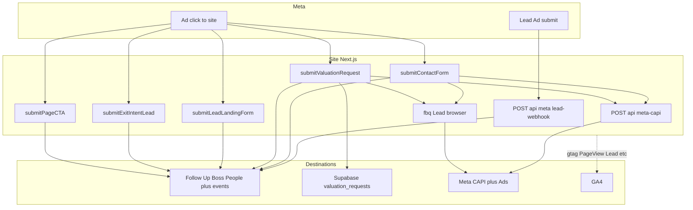

# Marketing lead flow — Ryan Realty

**Purpose:** Describe **every path** by which a prospect becomes a **known lead** in Follow Up Boss (FUB), what fires to **Meta** (pixel + Conversions API), **GA4**, and **Supabase**, and how weekly automation **observes** pipeline health. This doc is the **lead-centric** companion to **`docs/FACEBOOK_SELLER_GROWTH_PIPELINE.md`** (full seller-growth stack).

**For AI agents:** Load **`docs/FACEBOOK_SELLER_GROWTH_PIPELINE.md`** for architecture, crons, env matrices, and optimization loops. Load **this file** when the question is specifically **how a lead is created**, **what runs on submit**, **deduplication**, or **debugging missing FUB contacts**.

**Session context (2026-05-11):** Seller automation was advanced without CSV audience workflows or manual launch checklists: production **`marketing-optimization-report`** and **`fub-outreach-execution`** crons were triggered successfully; FUB contact snapshots use a **live People API fallback** when `fub_contacts_cache` / `fub_contacts` are absent; **`scripts/build-fb-ad.mjs`** was repaired for the current **`market_stats_cache`** schema; paid campaign creation via **`scripts/create-fb-ad.mjs`** remains gated on **Meta Marketing API token permissions** (`ads_management` + ad account access).

---

## Table of contents

1. [Definitions](#1-definitions)
2. [One-page diagram](#2-one-page-diagram)
3. [Path A — Meta Lead Ads (native form)](#3-path-a--meta-lead-ads-native-form)
4. [Path B — Website contact form](#4-path-b--website-contact-form)
5. [Path C — Home valuation request](#5-path-c--home-valuation-request)
6. [Path D — Exit intent and valuation CTA (FUB events)](#6-path-d--exit-intent-and-valuation-cta-fub-events)
7. [Path E — Lead landing pages](#7-path-e--lead-landing-pages)
8. [Path F — Page CTAs](#8-path-f--page-ctas)
9. [Identity stitching (before and after submit)](#9-identity-stitching-before-and-after-submit)
10. [Meta Conversions API and pixel deduplication](#10-meta-conversions-api-and-pixel-deduplication)
11. [Attribution and dashboard counting](#11-attribution-and-dashboard-counting)
12. [Where data lands (quick matrix)](#12-where-data-lands-quick-matrix)
13. [Environment variables by path](#13-environment-variables-by-path)
14. [Troubleshooting](#14-troubleshooting)
15. [Related files](#15-related-files)

---

## 1. Definitions

| Term | Meaning in this repo |
|------|----------------------|
| **Lead** | A identifiable person (email and/or phone) captured with intent (inquiry, valuation, Lead Ad submit, etc.). Operational truth is **FUB Person** + timeline events; Supabase rows are **analytics** unless stated otherwise. |
| **Conversion event fan-out** | Same user action triggers **FUB** (`sendEvent` or REST), optional **Supabase** insert, **Meta CAPI** (+ browser pixel with matching `event_id`), and **GA4** (via gtag / app helpers) where implemented. Not every path implements every sink. |
| **`event_id`** | Stable id shared between **browser** `fbq('track','Lead',..., { eventID })` and **server** CAPI payload so Meta **deduplicates** one physical conversion. |

---

## 2. One-page diagram

---

## 3. Path A — Meta Lead Ads (native form)

**User journey:** User sees ad → completes **Facebook or Instagram instant form** → Meta notifies Ryan Realty’s server.

**Server flow**

1. Meta `POST`s to **`/api/meta/lead-webhook`** with payload entries for field **`leadgen`**.
2. Handler verifies **`X-Hub-Signature-256`** using **`META_APP_SECRET`** (if unset, verification is skipped with a warning — **fix in production**).
3. For each lead id, app **`GET`**s Graph **`/{lead-id}`** with **`META_PAGE_ACCESS_TOKEN`** / **`META_PAGE_TOKEN`** to read **`field_data`**, campaign/ad set names, etc.
4. Parsed fields map to **`ParsedLead`** (first name, last name, email, phone, optional intent).
5. **`createFubContact`** **`POST`**s **`https://api.followupboss.com/v1/people`** with source like **`Facebook Lead Ad — {campaign}`**, tags (e.g. **`FB Lead Ad`**), optional **`FUB_PIPELINE_ID`** stage assignment, then adds a **note** with campaign context.

**Important:** This path **does not** go through Next.js contact or valuation server actions. There is **no automatic Supabase `valuation_requests` row** from Lead Ads unless something else records it. **Meta CAPI Lead** for this path is **not** wired in the webhook handler in the same way as site forms (optimization relies on Meta’s native lead + offline conversions patterns elsewhere).

**Canonical implementation:** `app/api/meta/lead-webhook/route.ts`.

---

## 4. Path B — Website contact form

**Entry:** `/contact` → **`submitContactForm`** in **`app/contact/actions.ts`**.

**Order of operations**

1. **`sendEvent`** (`lib/followupboss`) with type **`General Inquiry`**, person name/email/phone, **`message`** prefixed with **`[inquiryType]`**.
2. **`sendContactNotification`** (email alert — non-blocking on failure).
3. **`generateEventId()`** → server **`POST /api/meta-capi`** with **`eventName: 'Lead'`**, hashed PII handled inside route, **`customData.value`** tiered:
   - **$300** if inquiry type suggests property/listing
   - **$500** if seller/valuation wording
   - **$200** otherwise (general)
4. Client **`ContactForm.tsx`** on success: **`fbq('track','Lead', { content_name: inquiryType }, { eventID: eventId })`** + **`trackEvent('generate_lead', ...)`**.

**Dedup:** **`eventId`** links CAPI and pixel **`Lead`**.

---

## 5. Path C — Home valuation request

**Entry:** `/home-valuation` → **`submitValuationRequest`** in **`app/home-valuation/actions.ts`**.

**Order of operations**

1. **Insert** into Supabase **`valuation_requests`** (address, email, phone, **`source_url`**, etc.).
2. **`sendEvent`** type **`Seller Inquiry`** with property fragment when address parts exist.
3. Optional admin email; optional **automated CMA PDF** email path when property resolves.
4. **`POST /api/meta-capi`** with **`Lead`**, **`lead_type: 'seller_valuation'`**, **`value: 500`**, **`currency: 'USD'`**.
5. Client **`ValuationForm.tsx`**: **`fbq('track','Lead', { content_name: 'home_valuation' }, { eventID: eventId })`** + **`trackEvent('generate_lead', ...)`**.

**Dedup:** Same **`event_id`** pattern as contact form.

---

## 6. Path D — Exit intent and valuation CTA (FUB events)

These fire **FUB events only** (no CAPI block in the snippets reviewed — treat as **mid-funnel signals**, not full Lead CAPI unless extended later).

| Action | Server helper | FUB event type | Notes |
|--------|---------------|----------------|-------|
| Valuation CTA click tracking | **`trackHomeValuationCta`** (`app/actions/lead-capture.ts`) | **`Seller Inquiry`** | Requires session email or **`fub_cid`** cookie person |
| Exit intent popup submit | **`submitExitIntentLead`** | **`Registration`** | Partner referral side effects when campaign hints lender/relocation |

---

## 7. Path E — Lead landing pages

**Entry:** **`submitLeadLandingForm`** in **`app/actions/lead-landing.ts`**.

**Behavior:** Builds **`Seller Inquiry`** or **`General Inquiry`** from **`audience`** + intent fields; **`sendEvent`** to FUB with campaign block (**`landing_page`**); **`sendContactNotification`**. **No CAPI** in this file path — add here if landing traffic should feed Meta optimization the same way as `/contact`.

---

## 8. Path F — Page CTAs

**Entry:** **`submitPageCTA`** (`app/actions/lead-capture.ts`).

**Behavior:** **`General Inquiry`** or **`Seller Inquiry`** via **`sendEvent`** only (no valuation row, no CAPI in this helper).

---

## 9. Identity stitching (before and after submit)

Before forms resolve to a stable FUB person, the stack may set **`fub_cid`** (HTTP-only cookie) via **`FubIdentityBridge`** / **`identifyFubFromEmailClick`**, or associate Google sign-in with **`trackSignedInUser`**. After **`fub_cid`** exists, **`getFubPersonIdFromCookie`** lets server actions attach events to the **same person id**.

**Deep dive:** **`docs/FACEBOOK_SELLER_GROWTH_PIPELINE.md`** §3 and **`app/actions/fub-identity-bridge.ts`**.

---

## 10. Meta Conversions API and pixel deduplication

**Route:** **`POST /api/meta-capi`** (`app/api/meta-capi/route.ts`).

**Behavior:**

- Accepts **`eventName`**, optional PII → **SHA-256** hashes (**Meta norm**).
- Reads **`_fbp`** / **`fbc`** cookies from the **request** carrying the server action call (same browser session when cookies exist).
- Forwards to **`sendServerEvent`** in **`lib/meta-capi`** with optional **`event_id`**.

**Browser side:** **`fbq`** calls pass **`eventID`** matching server **`event_id`** on **`Lead`** where implemented (**contact**, **valuation**).

---

## 11. Attribution and dashboard counting

**Seller funnel Facebook attribution** (for **`sellerVisitsFromFacebook30d`** and downstream ratios in **`getDashboardMarketingData`**) counts **`visits`** rows whose **`path`** matches **`utm_source=facebook`**, **`fbclid=`**, or known **Facebook or Instagram or Messenger referrers** (see `app/actions/dashboard.ts` around seller Facebook filters).

**GA4:** Pulled into the same dashboard when service account + property access are valid; used for optimization scoring and weekly packets — not for creating FUB rows directly.

---

## 12. Where data lands (quick matrix)

| Path | FUB | Supabase | Meta CAPI Lead | Pixel Lead | GA4 |
|------|-----|----------|----------------|------------|-----|
| Lead Ad webhook | Yes People plus Note | No default | Not same as site Lead wiring | N/A on site | Via Meta or campaigns |
| Contact form | Yes | No dedicated row in snippet | Yes + value tier | Yes dedup | Via tracking helpers |
| Valuation | Yes | **`valuation_requests`** | Yes $500 | Yes dedup | Via tracking helpers |
| Exit intent / valuation CTA | Yes | No | No in helper | — | — |
| Lead landing | Yes | No in helper | No | — | — |
| Page CTA | Yes | No | No | — | — |

---

## 13. Environment variables by path

**Lead Ad webhook:** **`META_APP_SECRET`**, **`META_PAGE_ACCESS_TOKEN`** / **`META_PAGE_TOKEN`**, **`FUB_API_KEY`** / **`FOLLOWUPBOSS_API_KEY`**, optional **`FUB_PIPELINE_ID`**, optional **`FOLLOWUPBOSS_SYSTEM`** headers.

**Site forms + CAPI:** **`NEXT_PUBLIC_SITE_URL`**, **`META_CAPI_ACCESS_TOKEN`**, pixel id on client (**`NEXT_PUBLIC_META_PIXEL_ID`**), Supabase keys for **`valuation_requests`**.

**Weekly observability:** **`CRON_SECRET`**, dashboard GA keys — see pipeline doc §9.

---

## 14. Troubleshooting

| Symptom | Likely cause | Where to look |
|---------|----------------|---------------|
| Lead Ad submits but no FUB person | Webhook URL or **`leadgen`** subscription wrong; **`META_APP_SECRET`** mismatch; Graph token cannot read lead | Meta App Webhooks; logs **`[lead-webhook]`** |
| Duplicate Meta conversions | Missing or mismatched **`event_id`** between **`fbq`** and CAPI | Client form + **`/api/meta-capi`** payload |
| CAPI always weak match | No **`_fbp`** / **`fbc`** on server request; user blocking cookies | **`meta-capi` route** cookie reads |
| Valuation in DB but not FUB | **`sendEvent`** failed after insert | **`[valuation] FUB send failed`** logs |
| Dashboard Facebook visits zero but ads run | **`visits`** path not storing **`fbclid`** or UTM; referrer not classified | **`track-visit`** / landing URLs |
| Outreach cron zero targets | Legacy Supabase mirror missing | Uses **`fetchMyLeadsFromFubLive`** fallback — see **`lib/followupboss.ts`** |

---

## 15. Related files

| Area | Path |
|------|------|
| Lead Ad webhook | `app/api/meta/lead-webhook/route.ts` |
| CAPI ingress | `app/api/meta-capi/route.ts`, `lib/meta-capi.ts` |
| Contact lead | `app/contact/actions.ts`, `app/contact/ContactForm.tsx` |
| Valuation lead | `app/home-valuation/actions.ts`, `app/home-valuation/ValuationForm.tsx` |
| Mid-funnel capture | `app/actions/lead-capture.ts`, `app/actions/lead-landing.ts` |
| FUB SDK-style sends | `lib/followupboss.ts` (`sendEvent`, `fetchMyLeadsFromFubLive`, …) |
| Visit logging | `app/actions/track-visit.ts` |
| Marketing dashboard | `app/actions/dashboard.ts` |
| Weekly packets | `app/api/cron/marketing-optimization-report/route.ts`, `app/api/cron/fub-outreach-execution/route.ts` |
| Paid spec automation | `scripts/build-fb-ad.mjs`, `scripts/create-fb-ad.mjs` |

**Also read:** **`docs/FACEBOOK_SELLER_GROWTH_PIPELINE.md`**, **`docs/FB_SELLER_CAMPAIGN_PLAYBOOK.md`** (campaign ops), **`.cursor/rules/marketing-advertising-workflow.mdc`**, **`.cursor/skills/facebook-seller-growth/SKILL.md`**, **`docs/marketing/facebook-seller-growth-LEARNINGS.md`**.
